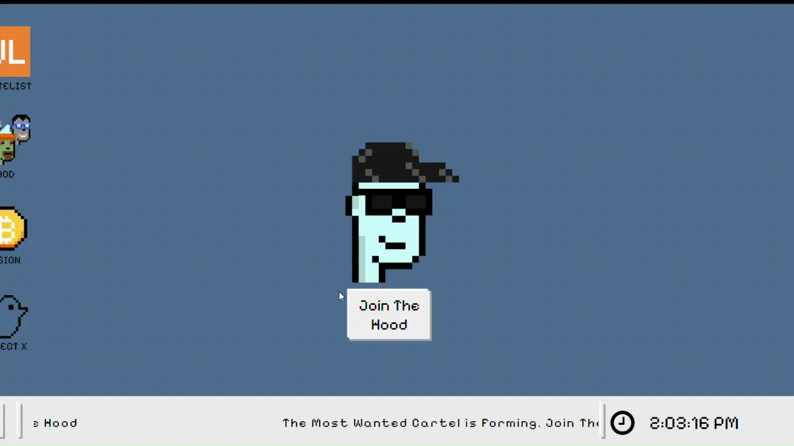

# NakamotoGCartel

NakamotoGCartel is a website dedicated to promoting WEB3 technology. The project aims to educate and engage users in the decentralized ecosystem. 

## Technologies Used
- **JavaScript** – for dynamic interactions and functionality.
- **CSS** – for styling and visual presentation.

## Website
Visit the live project at: [https://www.nakamotogcartel.com/](https://www.nakamotogcartel.com/).

## Features
- Information and insights about WEB3.
- Engaging design and user-friendly experience.
- Lightweight and efficient frontend implementation.

